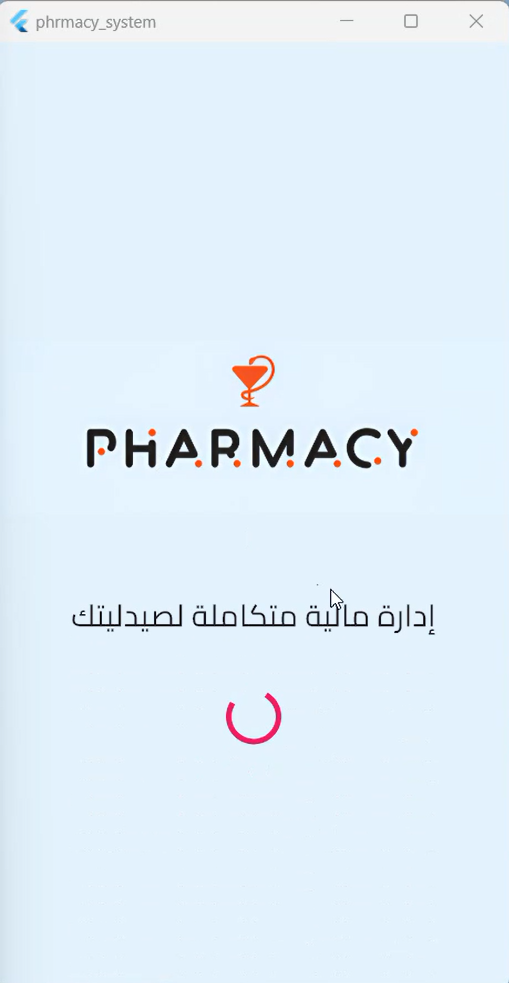

# 💊 Pharmacy Accounting App – Flutter + Firebase

A complete accounting and financial tracking solution tailored for **pharmacy businesses**, developed using **Flutter** with **Cubit** for state management. The app uses **Hive** for local storage and **Firebase** as an online backup solution.

---

## 🗂️ Application Modules

### 💵 Revenues
- Add revenue entries with optional notes.
- Timestamp recorded automatically.
- Entries can only be modified within 24 hours.
- Total revenue is displayed.
- Filter data by month.

### 📤 Expenses
- Same features as revenues module.
- Track total expenses.
- Filter by date/month.

### 👥 Partners
- Add partners and assign share percentages.
- Ensures total shares do not exceed 100%.
- Stores and displays partner information.

### 📊 Yearly Profits
- Calculates **net profit = revenues - expenses**.
- Automatically distributes profits based on partner shares.

---

## 🌟 Key Features

- 🚀 Fast & responsive UI.
- 🛡️ Records are protected from edits after 24 hours.
- 📅 Monthly filtering for clean data overview.
- ⚙️ Flexible structure, easily adaptable to other business types.

---

## 🧰 Tech Stack

- **Framework:** Flutter (Dart)
- **Remote Database:** Firebase
- **Architecture:** MVVM
- **State Management:** Cubit
- **Packages:** `intl`, `flutter_bloc`, `hive_flutter`

---

## 🚀 Status

✅ Production-ready  
📦 Suitable for single or multi-owner pharmacies  
🧩 Adaptable for other financial record-keeping use cases

---
### 📸 App Screenshots

| Splash | Add Pharmacy | Expenses |
|--------|--------------|----------|
|  |  |  |

| Partners | Annual Profits | Revenues |
|----------|----------------|----------|
|  |  |  |

💬 **Suggestions, ideas, and collaborations are welcome!**
